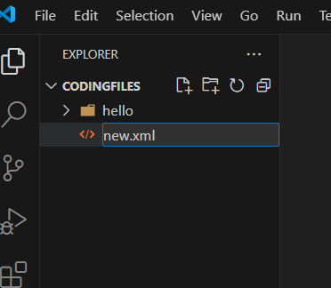
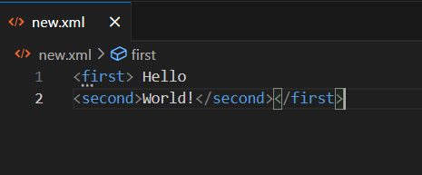
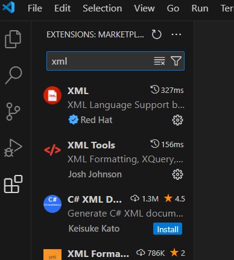
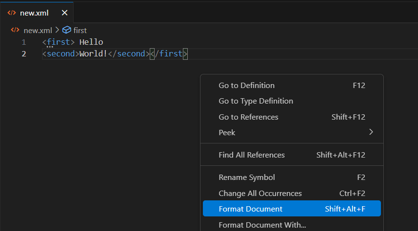
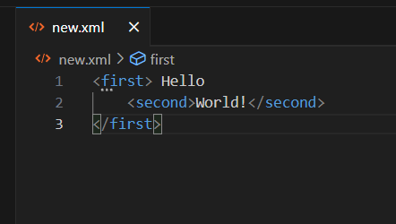

# Basic setup for XML on VS Code

### Formatting your XML file

XML is Extensible Markup Language like HTML but with customizable tags.

<!-- more -->

Visual Studio Code (VS Code) is a code editor. You can Install it with this link
<https://code.visualstudio.com/download>

Following are the steps

1. Open VS Code
2. Open any folder where you would like to save your file
3. Create a new file with .xml extension

    

4. Below is a simple xml code

    `<first> Hello
    <second>World! </second></first>`

    

5. On left bar of VS Code, you will see an extension icon
6. Search for “XML”. You can install any extension based on your requirements. For now, we are installing the second option, which is “XML Tools”.

    

7. After installation, right-click in the XML file and you will   see the "Format Document" option.

    

8. On clicking "Format Document," your XML file gets formatted

    

In this way you can easily format your XML file in VS Code.
